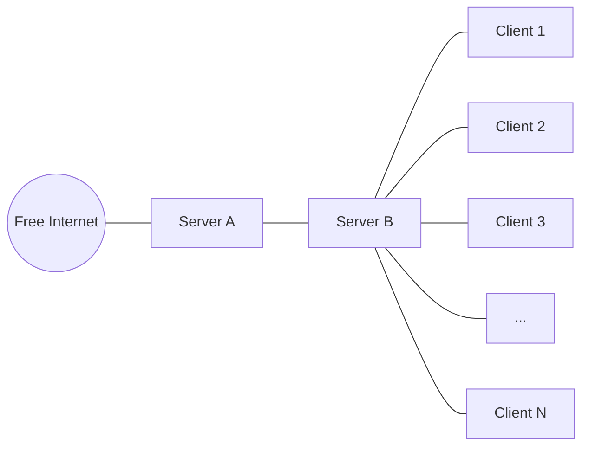

# Introduction
This project can be used to setup a 1 to 1 VPN tunnel between two servers. On one end a second VPN server will be running to provide VPN connection to multiple clients.
The main purpose of this project is to bypass internet censorship and filtering wherever implemented.

This project started during the 2022 protests in Iran.

# Problem Description
The main problem we are trying to solve, is the severe restrictions put on the internet access in totalitarian countries.
In these countries, access to the internet is very limited and is possible only to specific websites.

In this situation, sometimes the government offers an alternative Intranet instead of the free internet. They may call it the "National Internet". Which is basically a huge intranet in which people can access the selected services and web sites that are hosted inside country, and are controlled by the government.

In such countries, whenever there are protests ongoing, the internet access will be even further restricted.
Sometimes the restriction process works as follows:
1. The "National Internet" mode is enabled and access to the outside world is cut down.
2. Access to the internet from the mobile network is restricted (No cell phone will be able to access google.com for example)
3. Access to the internet from the main ISPs is restricted (No home DSL/WiMax/Dial-Up!! will be able to access google.com for example)
4. Total blackout of the internet.

The problem we are trying to solve is to find a way to stay connected to the outside world as long as possible.

# How VPP works
## Basic Setup
This repository contains the required ansible role and playbooks to setup a VPN tunnel between two servers A and B. Server B is located inside the restricted area (where heavy censorship is in place) and server A is located somewhere else with free access to the internet.



## How it helps
While the previously mentioned censorship process will cut off access to the internet for most of the users, there will still remain some servers who can have access to the internet.
These servers are the ones inside specific datacenters in which some government servers also exist.
During the internet shudown, some financial systems, post systems, and some other systems still need to have access to the outside world.
Also some startups and businesses have already paid a lot of money to the government to stay connected to the outside world even if there are some restrictions on the internet access for others.
This usually means that some datacenters are to be filtered the last. They will stay connected to the internet until the internet is shut down completely.
Therefore, by placing the server B inside one of those datacenters, clients will be able to access internet up to the last moment (until the whole internet access is blocked by the government).

## Requirements
When you clone this repo, you'll have an almost ready to go ansible structure in your working directory. 
Only 2 steps are required before you can use the playbooks:
1. Add the IP address of the purchased servers (A, B) in the inventory.yml file.
2. Add the ssh private keys used to connect to these servers (root access) to the keys directory.

### Add Servers to the Inventory
To add IP address of the servers, you just need to add them into the inventory.yml file.
To do so, just add the IP address of the server B (the one inside the restircted region, e.g. Iran) to the iran_servers part, also for each server in the restricted area, there is a "peer" attribute available. The peer attribute is a list of peer servers for this restricted server.
In a single peer setup as depicted above, the peer for server B is server A and should be added to the inventory.
In a multi-peer setup, it is possible to specify multiple "foreign" servers for each IR server. This way, the IR server will change its peer after a random amount of time, further avoiding detections. Also if the connection quality drops significantly for some time, the IR server will switch to another foreign server automatically. Of course, the list can also have only one peer server in which case there will be no switching and this is called a single-peer setup.
Please note that at the moment, each foreign server can have only one peer.

An example of the inventory file for single-peer setup:
```
all:
  hosts:
  children:
    iran_servers:
      hosts:
        X.X.X.X:
          peers:
            - Y.Y.Y.Y
      vars:
        country: "Iran"
    foreign_servers:
      hosts:
        Y.Y.Y.Y:
          peer: "X.X.X.X"
      vars:
        country: "Foreign"
```

An example of the inventory file for multi-peer setup:
```
all:
  hosts:
  children:
    iran_servers:
      hosts:
        X.X.X.X:
          peers:
            - Y.Y.Y.Y
            - Z.Z.Z.Z
            - W.W.W.W
      vars:
        country: "Iran"
    foreign_servers:
      hosts:
        Y.Y.Y.Y:
          peer: "X.X.X.X"
        Z.Z.Z.Z:
          peer: "X.X.X.X"
        W.W.W.W:
          peer: "X.X.X.X"
      vars:
        country: "Foreign"
```
In the second example above, the X server (X.X.X.X) is located in the restricted/censored area, and the Y server as well as the Z and W server are located outside the restricted area.
The X server, has 3 peer servers to connect to (Y,Z,W). And it will connect to each of them, one after another, after a random amount of time. Also if the connection between the X server and for example the Y server gets disrupted, it will automatically connect to the next peer server in the list (Z in this case).
Also please note that in the "foreign_servers" part, there are 3 different servers, but all having the same peer (X).

### Add ssh private keys to the key directory
To add the private keys to the "key" directory, you should name them correctly. The naming convension is quite simple.
Just add the IP address of the host, and then add _ssh_key.pem to the end. Also you might need to change the permision of the keyfiles to sth like 400 and not more.
This way ansible will be able to connect to those servers and do the setup.
Please note that keys should have root access to the host for now (i.e. ansible should be able to login as "root" using the provided keys).
So, if a host is accessible via IP address 1.2.3.4 the key should be named:
```
1.2.3.4_ssh_key.pem
```
and you should put it inside the "keys" directory.

## Possible Challenges
If users try to access websites which are banned according to the regulations of the target country (the country where Server A is located), then the owner of the Server A will have to face the consequences (e.g. banning of their account, ...)

## How to run the playbooks
### Setting up the servers
After providing the keys and adding the hosts into the inventory, run the following command:
```
ansible-playbook -i inventory.yml playbooks/ovpnsetup.yml
```

This will take some time, and then the servers will be ready to go.

### Adding some clients
To add clients, simply run the addclient playbook:
```
ansible-playbook -i inventory.yml playbooks/add_client.yml -l "Y.Y.Y.Y" --tags addclient
```
Note that how we limitted the execution of the playbook to the mentioned server (this is the B server, e.g. the one located in Iran).

After that, in the control host (the host which you ran the ansible-playbook command on), there will be a folder containing the config file for the recently added client.
Please not that all the client config files will ask for a password at some point, after running the addclient playbook, the password will be printed out on the screen in a debug message at the end of the playbook execution.

## Setting up monitoring
It is also possible to setup a Grafana dashboard, depicting the connection speed between peer servers and also the load time of some common pages both from the IR side of the tunnel and from the foreign servers themselves.
To setup the Grafana dashboard and the requirements for that (Prometheus, exposed metrics, ...) you can run the monitoring_setup playbook (do that after the main ovpn setup).
```
ansible-playbook -i playbooks/monitoring_setup.yml
```
After the execution of this playbook, an admin password will be printed on the screen, copy that somewhere, because you'll not be able to see it anywhere else.
Using the provided credentials, you'll be able to access the monitoring dashboard running on your IR server, port 3000 by default.

# Limitations
As of now, only Ubuntu 22.0.4 systems are supported. Others may work, but not tested.

# Future Developments
We believe in decentralized approach.
The goal of this project is to make it easy for everyone to setup this tunneling mechanism. Everyone inside the totalitarian countries, knows someone from outside who can purchase the "Foreign Server" for them, and they can purchase the "Internal Server" themselves. 
Having this pair of servers, the tunnel can be set up easily.

This way, each pair of servers, is not supposed to server multiple thousands of users, but maybe some hundereds at most.
But there will be hundereds of such A-B pairs.

In order to reach that point, we plan to provide a website template, that when implemented, will bring up a web page, in which people can donate server pairs and setup server pairs, and users can choose a specific pair to connect through.

For that, we are planning to develope the required playbooks/roles/scripts so that the site setup will also be easy for everyone.


# How to participate
If you want to help improving the service, you need to create pull requests. But do not use your personal GitHub user for that. Try to stay as much anonymous as possible. Create an anonymous GitHub user, using an anonymous mail service like protonmail or ... and contribute to this project only using that account.

This is to avoid being identified and chased by government agents.

We will try to study the PRs and merge them if suited.
